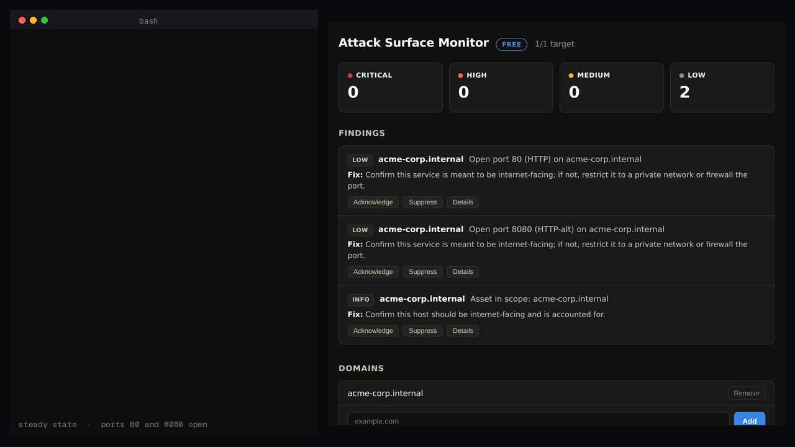

# Attack Surface Monitor

**Self-hosted attack surface discovery & exposure monitoring — it sees you the way an attacker does.**



*Real run: a steady-state sweep with ports 80 and 8080 open. A deploy opens 5432 and takes 8080
away — and the next sweep raises PostgreSQL as CRITICAL and marks the old port resolved on its own.
Nobody edited an inventory; the list only moves when the attack surface does.*

You can't defend what you don't know is exposed. Attack Surface Monitor discovers your internet-facing assets and flags what's dangerously open, from your own server:

- **Passive discovery** — finds subdomains via Certificate Transparency logs and DNS; keeps only the names that currently resolve as live assets
- **Exposure detection** — reachable databases (PostgreSQL / MySQL / MongoDB / Redis / Elasticsearch), open RDP / VNC / Telnet, and a full open-port inventory
- **The daily diff** — a new subdomain or a newly opened port shows up as a new finding; a closed port or removed asset auto-resolves. Always answers *"what changed on my attack surface?"*, not just *"what does it look like right now?"*
- **Findings that tell you what to do** — every finding ships with its fix, deduplicated across scans, auto-resolved when the exposure is gone
- **Notifications that don't spam** — a burst of changes becomes one digest, worst first, not a message per finding

> *A vuln scanner asks "is it exploitable?" ASM asks the question that comes first: "what of mine is even reachable?"*

## Scan only what you own

ASM performs **active probing**, so it will not touch a domain until you prove you control it — a DNS `TXT` record or an HTTP file. Passive discovery uses only public records; active probing runs **only after** a domain is verified. This is a built-in safeguard that keeps you on the right side of computer-misuse law. See [`AUTHORIZATION`](#authorization) below.

## Self-hosted by design

Runs as a single binary or container on your infrastructure. **Your asset list and findings never leave your network.** Outbound connections only. No telemetry, no phone-home — license validation is pure local cryptography.

## Quick start

```bash
# Docker — build the image from this repo first; there is no published asm image
docker build -t asm .
docker run -d -p 127.0.0.1:8423:8423 -v asm-data:/data asm

# Or the bare binary
./asm
```

Open `http://127.0.0.1:8423`, add a domain, follow the verification instructions, and ASM starts monitoring once ownership is proven.

## Editions

| | Free (this repo) | Pro | Team |
|---|---|---|---|
| Monitored domains | 1 | 10 | Unlimited |
| Scan interval | Weekly fixed | Custom + scan-now | Custom + scan-now |
| Notifications | Webhook, syslog | + Email, Slack, Telegram | + PagerDuty, MS Teams |
| History | 14 days | 1 year | Unlimited |
| Support | Community | Email | Priority |

**Whop sells paid licences only.** Free: github.com/nizartuanku/attack-surface-monitor — this repository is the free edition, Apache-2.0, no time limit; nothing on Whop is free, so try it here first.

Pro ($29/mo) and Team ($99/mo) licenses, each with a 14-day free trial:
**https://whop.com/nizar-tuanku/attack-surface-monitor?utm_source=github**

A license key activates instantly and validates **offline** — ASM never needs to reach our servers. An expired key never bricks the product; it simply returns to free limits.

## Authorization

By verifying a domain and scanning it, you warrant that you own it or are explicitly authorised to test it. Only add domains your organisation owns or has written permission to test. Do not point ASM at third-party infrastructure, shared hosting you don't control, or a provider's systems without their authorisation — some cloud providers also require notice before security testing. ASM does not exploit, brute-force, or run intrusive payloads: it reports exposure, it does not attack.

## Requirements

- Linux (Ubuntu 22.04+ recommended), amd64
- Outbound network access to the domains you monitor and to Certificate Transparency (crt.sh) for passive discovery

## Working with the other Hexward tools

Every tool in the line can emit its findings as syslog, which is how they feed
each other:

```bash
asm -syslog loglight.internal:5514        # udp by default
asm -syslog loglight.internal:5514 -syslog-network tcp
```

One RFC 3164 frame per finding, severity mapped onto the syslog severity so
your collector's existing routing rules still work, and the source address
carried in `src=` when the finding has one.

Point it at [Loglight](https://github.com/nizartuanku/loglight) and its findings
land next to Loglight's own detections: a Decoy trip from an address Loglight
already saw port-scanning is raised as one critical incident with the timeline
attached, rather than two alerts you have to join up yourself. Any other syslog
collector works too — there is nothing Hexward-specific about the format.

Available on every tier, free included.

## AI Assist (optional)

"Attack can explain a finding in plain language with a small language model that runs on
your own hardware. It is off by default. Turn it on by starting a
[hexward-ai](https://github.com/nizartuanku/hexward-ai) sidecar and pointing "Attack at it:

```sh
asm -ai-assist-url http://127.0.0.1:8435
```

Each finding then gets an **✨ Explain** button. The model writes what the finding means and
what to verify before you act. It also gets a fixed disclaimer.

- **The engine still decides.** The model receives one finding after "Attack has produced it.
  It cannot add, remove, re-score or close a finding. If the sidecar is off, slow or broken,
  the button shows a short note and nothing else changes.
- **What leaves the process.** One finding: its check, title, target, severity, status,
  remediation and a sanitised copy of its evidence. Keys that look like secrets (password,
  token, secret, private, credential, cookie, session, signature and similar) are dropped
  first. Nothing goes to the internet. The sidecar runs where you run it.
- **Editions.** The free edition works with a sidecar on the same host. That is the `lab`
  profile, SmolLM3-3B. Pro and Team can also use one dedicated AI host for several products,
  or your own OpenAI-compatible endpoint, through `-ai-assist-key-file`. The recommended
  profile there is `smb` (Phi-4-mini-instruct). Enterprise uses Qwen3 or your own endpoint.
- **Language.** English is the supported language in this release. `-ai-assist-lang id`
  (Bahasa Indonesia) remains as an unsupported preview. More languages will be added based on
  demand.
- **Honest limit.** Small local models sometimes add general background that is not in the
  evidence. For example, they may name a well-known attack, and that background can be wrong.
  Treat the explanation as a starting point. The finding, its evidence and its fix text remain
  the record, which is why every explanation carries the "verify against raw findings" line.
- **Speed.** On a CPU-only machine an explanation takes about 15–50 seconds, depending on the
  model. Measurements are in hexward-ai's `docs/TIERS.md`.

Environment equivalents: `Surface_AI_ASSIST_URL`, `Surface_AI_ASSIST_KEY_FILE`,
`Surface_AI_ASSIST_LANG`, `Surface_AI_ASSIST_NO_THINKING=1`.

## Honest limits

- ASM finds **exposure**, not exploitable vulnerabilities — pair it with a vulnerability scanner for the "is it exploitable?" question.
- Passive discovery is not exhaustive: assets absent from Certificate Transparency and DNS won't be found by default. ASM shows which sources contributed so coverage is honest.
- It sees only what's reachable from where it runs — for internal-only assets, run a separate instance inside that network segment.
- It scans only domains you've verified.

## Built by

Nizar Tuanku — Cybersecurity. Part of the Hexward line of self-hosted security tools.
Watch your certificates too? See [CertLight](https://whop.com/nizar-tuanku/certlight-tls-monitor?utm_source=github).
